<div align="center">


# 🚀 AI-Powered Anomaly Detection System

<p align="center">
  
  
  
  
</p>

<h3 align="center">Advanced ensemble learning system for industrial process monitoring and time series anomaly detection</h3>

<p align="center">
  <strong>✨ Optimized for cloud deployment with professional-grade analytics ✨</strong>
</p>

</div>

---

## 🌟 Features & Capabilities

<div align="center">

|  🎯 **Core Features**  |  🚀 **Advanced Analytics**  |  💻 **User Experience**   |
| :--------------------: | :-------------------------: | :-----------------------: |
|   Ensemble Learning    |   Real-time Visualization   | Interactive Web Interface |
| Cloud-Ready Deployment | Feature Importance Analysis |  Professional UI Design   |
|  In-Memory Processing  |    Comprehensive Reports    |    Export Capabilities    |

</div>

> [!NOTE]  
> **🧠 Advanced Ensemble Learning**: Combines `Isolation Forest`, `One-Class SVM`, and `PCA-based detection` for superior anomaly detection accuracy

---

## 🎥 Demo Video

<div align="center">
  🚀 Watch the System in Action
https://github.com/user-attachments/assets/d8851af7-bfc6-488e-a7d9-400046bfbf95
</div>


## 🚀 Quick Start Guide

<details>
<summary><b>🏠 Option 1: Local Development</b></summary>

```bash
# 📥 Clone the repository
git clone <your-repo-url>
cd ai-powered-anomaly-detection

# 📦 Install dependencies
pip install -r requirements.txt

# 🎯 Run the application
streamlit run streamlit_app.py
```

</details>

<details>
<summary><b>🔧 Option 2: Launch Script</b></summary>

```bash
# 🚀 Run the optimized launcher
python scripts/run_streamlit.py
```

</details>

<details>
<summary><b>☁️ Option 3: Streamlit Cloud Deployment</b></summary>

<div align="center">

### 🌐 Deploy to Streamlit Cloud in 3 Steps

</div>

<table align="center">
<tr>
<td align="center"><b>Step 1</b><br>🍴 Fork Repository</td>
<td align="center"><b>Step 2</b><br>🔗 Connect GitHub</td>
<td align="center"><b>Step 3</b><br>🚀 Deploy App</td>
</tr>
<tr>
<td align="center">Fork this repo to your account</td>
<td align="center">Visit <a href="https://share.streamlit.io">share.streamlit.io</a></td>
<td align="center">Set main file: <code>streamlit_app.py</code></td>
</tr>
</table>

</details>

## 📁 Project Architecture

<div align="center">

### 🏗️ Clean & Organized Structure

</div>

```
📦 ai-powered-anomaly-detection/
├── 🎯 streamlit_app.py              # Main Streamlit application (cloud-ready)
├── 📋 requirements.txt              # Python dependencies (cloud-optimized)
├── 📖 README.md                     # This documentation
├── 📊 TEP_Train_Test.csv           # Sample dataset
└── 📂 scripts/
    ├── 🧠 optimized_anomaly_detection.py  # Core ML system
    ├── 🚀 run_streamlit.py                # Local launcher script
    └── 🗂️  streamlit_app.py               # Legacy app (deprecated)
```

> [!IMPORTANT]  
> **File Organization**: Main entry point is `streamlit_app.py` in root directory for optimal cloud deployment

<div align="center">

## 🔧 Cloud Deployment Optimizations

### ⚡ Performance & Reliability Enhancements

</div>

<table align="center">
<tr>
<th>🛠️ Fixed Issues</th>
<th>🚀 Cloud Features</th>
</tr>
<tr>
<td valign="top">

- ✅ **Import Path Resolution**<br>
  <sub>_Proper module handling_</sub>
- ✅ **File I/O Elimination**<br>
  <sub>_Complete in-memory processing_</sub>
- ✅ **Launch Script Fix**<br>
  <sub>_Infinite loop resolution_</sub>
- ✅ **Dependency Compatibility**<br>
  <sub>_Relaxed version requirements_</sub>
- ✅ **Streamlit Configuration**<br>
  <sub>_Optimal cloud config_</sub>

</td>
<td valign="top">

- 💾 **In-Memory Processing**<br>
  <sub>_Zero file system writes_</sub>
- 🔗 **Dynamic Import Handling**<br>
  <sub>_Automatic path resolution_</sub>
- ☁️ **Streamlit Cloud Optimized**<br>
  <sub>_Best practice compliance_</sub>
- 🛡️ **Error Resilience**<br>
  <sub>_Comprehensive fallbacks_</sub>
- 🎯 **Performance Tuned**<br>
  <sub>_Efficient memory usage_</sub>

</td>
</tr>
</table>

<div align="center">

## 📊 How to Use the System

### 🎮 Simple 4-Step Process

```mermaid
graph LR
    A[📁 Upload Dataset] --> B[⚙️ Configure Parameters]
    B --> C[🚀 Run Analysis]
    C --> D[📈 View Results]
    D --> E[💾 Download Reports]

    style A fill:#e1f5fe
    style B fill:#f3e5f5
    style C fill:#e8f5e8
    style D fill:#fff3e0
    style E fill:#fce4ec
```

</div>



<details>
<summary><b>📋 Step-by-Step Instructions</b></summary>

|  Step  | Action                   | Description                                    |
| :----: | :----------------------- | :--------------------------------------------- |
| **1️⃣** | **Upload Dataset**       | Use the file uploader to select your CSV file  |
| **2️⃣** | **Configure Parameters** | Adjust model parameters in the sidebar         |
| **3️⃣** | **Run Analysis**         | Click "Start Anomaly Detection" to process     |
| **4️⃣** | **View Results**         | Explore interactive visualizations and metrics |
| **5️⃣** | **Download Results**     | Export CSV results or summary reports          |

</details>

---

<div align="center">

## 🎯 Advanced Model Configuration

### 🔬 Fine-tune Your Analysis

</div>

<table align="center">
<tr>
<th>🎛️ Parameter</th>
<th>📊 Range</th>
<th>💡 Purpose</th>
</tr>
<tr>
<td><code>Contamination Rate</code></td>
<td><kbd>0.001 - 0.1</kbd></td>
<td>Expected proportion of anomalies</td>
</tr>
<tr>
<td><code>Number of Estimators</code></td>
<td><kbd>50 - 500</kbd></td>
<td>Trees in Isolation Forest</td>
</tr>
<tr>
<td><code>Outlier Removal</code></td>
<td><kbd>ON/OFF</kbd></td>
<td>Remove extreme training outliers</td>
</tr>
<tr>
<td><code>PCA Analysis</code></td>
<td><kbd>ON/OFF</kbd></td>
<td>Advanced feature importance</td>
</tr>
</table>

> [!TIP]  
> **Optimal Settings**: Start with default values, then fine-tune based on your data characteristics

<div align="center">

## 📈 System Output & Analytics

### 🎯 Comprehensive Analysis Results

</div>

<table align="center">
<tr>
<th colspan="2">🔍 Analysis Components</th>
</tr>
<tr>
<td align="center">

**🎯 Core Metrics**

- `Abnormality Score` (0-100 scale)
- `Top 7 Contributing Features`
- `Training Validation Results`

</td>
<td align="center">

**📊 Visual Analytics**

- `Time Series Plots`
- `Distribution Charts`
- `Feature Importance Graphs`

</td>
</tr>
<tr>
<td colspan="2" align="center">

**📋 Export Options**

- `CSV Results` • `Summary Reports` • `Technical Details`

</td>
</tr>
</table>

> [!CAUTION]  
> **Score Interpretation**: Scores above `30` indicate potential anomalies, above `75` require immediate attention

## 🔬 Technical Details

<details>
<summary><b>🎯 Ensemble Learning Components</b></summary>

```
🌳 Isolation Forest (Primary)
├── Bootstrap Sampling
├── Random Feature Selection
└── Anomaly Score Generation

🎯 One-Class SVM (Secondary)
├── RBF Kernel Function
├── Nu-Parameter Tuning
└── Decision Boundary Learning

📊 PCA Reconstruction (Tertiary)
├── Dimensionality Reduction
├── Reconstruction Error Calculation
└── Feature Importance Mapping
```

</details>

<details>
<summary><b>🔧 Data Processing Pipeline</b></summary>

| Component           | Technology  | Purpose                   |
| :------------------ | :---------- | :------------------------ |
| `RobustScaler`      | Sklearn     | Outlier-resistant scaling |
| `Median Imputation` | Custom      | Missing value handling    |
| `Outlier Removal`   | IQR-based   | Training data cleaning    |
| `Period Detection`  | Statistical | Auto train/test split     |

</details>

<details>
<summary><b>✅ Validation & Quality Assurance</b></summary>

> **Multi-Criteria Training Validation**
>
> - Mean score thresholds
> - Maximum score limits
> - Standard deviation checks
> - Percentile-based validation

> **Iterative Parameter Tuning**
>
> - Automatic contamination adjustment
> - Model performance optimization
> - Baseline calibration system

</details>

<div align="center">

## 🛠️ Development & Testing

### 👨‍💻 Local Development Setup

</div>

<details>
<summary><b>🔧 Development Commands</b></summary>

```bash
# 📦 Install in development mode
pip install -e .

# 🧪 Run tests (if available)
python -m pytest

# 🎯 Run the core system directly
python scripts/optimized_anomaly_detection.py TEP_Train_Test.csv results.csv

# 🚀 Launch development server
streamlit run streamlit_app.py --server.runOnSave true
```

</details>

---

<div align="center">

## 📋 System Requirements

### 💻 Dependencies & Versions

</div>

<table align="center">
<tr>
<th>🐍 Core</th>
<th>📊 ML/Data</th>
<th>🎨 Visualization</th>
</tr>
<tr>
<td align="center">

`Python 3.7+`<br>
`Streamlit 1.28.0+`

</td>
<td align="center">

`Pandas 1.5.0+`<br>
`NumPy 1.21.0+`<br>
`Scikit-learn 1.0.0+`

</td>
<td align="center">

`Plotly 5.0.0+`<br>
`Matplotlib (optional)`

</td>
</tr>
</table>

<div align="center">

## 🚀 Deployment Status


### ✅ **Ready for Streamlit Cloud Deployment**

</div>

<table align="center">
<tr>
<th>🛡️ Reliability Features</th>
<th>⚡ Performance Features</th>
</tr>
<tr>
<td align="center">

✅ Zero file system dependencies<br>
✅ Proper import path handling<br>
✅ Cloud-compatible configuration<br>
✅ Comprehensive error handling

</td>
<td align="center">

🚀 In-memory processing<br>
🎯 Optimized algorithms<br>
💾 Efficient memory usage<br>
🖥️ Professional UI/UX design

</td>
</tr>
</table>

---

<div align="center">


</div>
